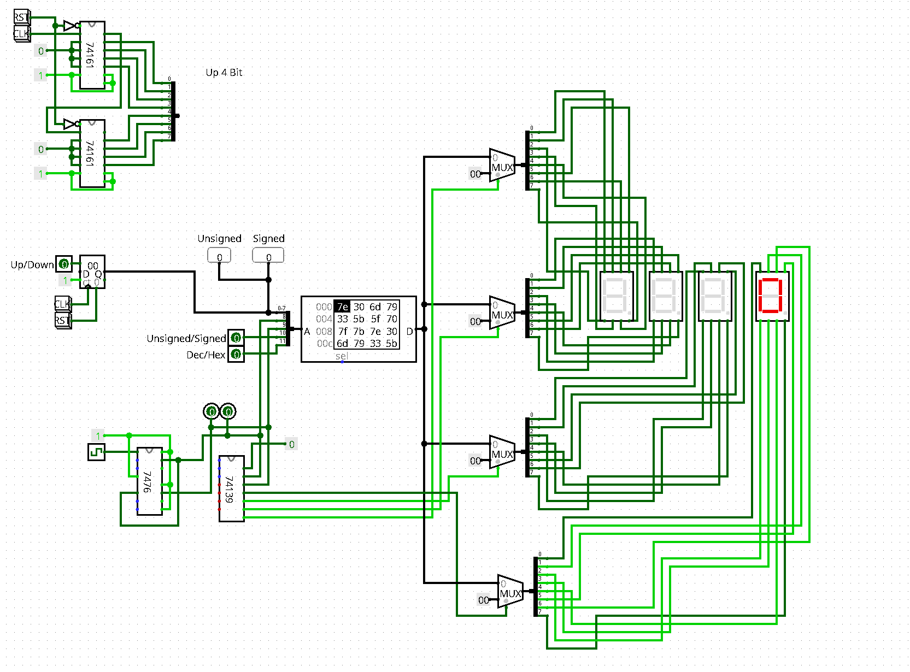

# Logisim Circuits

This repository contains logisim circuits and libraries
to accompany a seminar.

One can use logisim to layout the circuits and test out things
online with greater debugging possibilities and freedom.

Advantages are, for instance, to 
* ignore electricity, 
* generate modules to abstract complexity,
* copy and iterate on a design with version control,
* see the voltage level of any cable at any time,
* use components that you do not have physically available,
* ...

The view the circuits open the *.circ files in logisim.
You can use the provided logisim jar or the logisim package from your distribution.

## Restrictions

Logisim operates on a higher level than one would in hardware.
Therefore, many problems and subtleties are lost.
On the other hand, this allows for more freedom in designing the circuits.
Additionally, not every integrated circuit might be available out of the box.

## Libraries

### cs316

This library has many output modules like LCD Banners, LCD video displays, and keyboards available.

### Logi7400IC

74XX integrated circuits with a convenient layout and names.

### Logi7400DIP

DIP layouts of 74xx integrated circuits like you would use physically.

## Circuits

### LCD

A display for numbers that also supports negative values.
The conversion (BCD) from binary to 7-segment is performed using an (EEP)ROM instead of combinatory logic.

File: [lcd2.circ](lcd2.circ)

